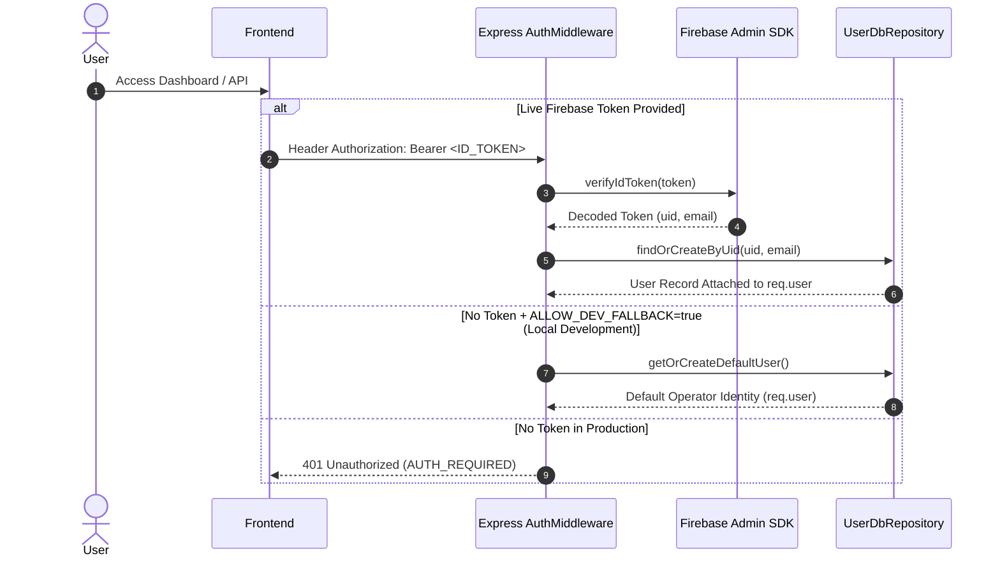

# Nolyvatix - Technical Architecture Blueprint

**Document Version:** 1.1.0  
**Status:** Synchronized Architectural Blueprint  
**Author:** Lead Software Architect & Principal Engineering Team  
**Target Platform:** Stellar Blockchain Ecosystem  

---

## 1. Overall System Architecture

Nolyvatix is engineered as a **Full-Stack Decoupled Modular Application with Real-Time Event Streaming**, optimized for high-throughput blockchain ingestion, sub-second query latency, and AI-driven intelligence.

### High-Level System Architecture Diagram

```mermaid
flowchart TB
    subgraph External Blockchain & AI Services
        Horizon["Stellar Horizon REST / SSE APIs"]
        SorobanRPC["Soroban JSON-RPC 2.0 (mainnet.sorobanrpc.com)"]
        GeminiAPI["Google Gemini 2.5 Flash (@google/genai)"]
        FirebaseAuth["Firebase Authentication Service"]
    end

    subgraph Backend API & Data Engine (Express 4 + Node.js)
        AuthMiddleware["Firebase Auth & Tenant Scoping (Dev Fallback)"]
        EventBus["StellarEventBus (SSE Live Stream Gateway)"]
        CacheLayer["Dual-Tier Caching (MemoryCache + StellarCache)"]
        
        subgraph Domain Services
            LedgerService["Ledger & Throughput Service"]
            SorobanService["Soroban APM & Event Decoder"]
            CorridorService["Asset & Liquidity Pool Service"]
            AIService["Gemini AI & Heuristic Synthesis Engine"]
            DashboardService["Dashboard & Widget Engine"]
            AlertService["Alert Rule & Notification Engine"]
            ReportService["Report Generation & Export Service"]
        end

        subgraph Repository Layer
            DBRepos["Drizzle ORM Relational Repositories"]
            MemFallback["Automatic In-Memory Storage Fallback"]
        end
    end

    subgraph Persistence Layer
        PostgreSQL[(PostgreSQL Database - 11 Drizzle Tables)]
    end

    subgraph Frontend Client (React 19 + Vite 6 + Tailwind v4)
        UIStateStore["Zustand Client Store"]
        QueryCache["TanStack React Query Cache"]
        ViewRouter["AppRouter & Route Registry (12 Views)"]
        AIWidget["Gemini AI Drawer & Synthesis Widget"]
        WalletModal["Stellar Wallet Modal (Mock / Extension Demo)"]
    end

    %% Ingestion & Inflow
    Horizon -->|SSE Ledger Stream| EventBus
    Horizon -->|REST Query| LedgerService
    SorobanRPC -->|JSON-RPC 2.0| SorobanService
    GeminiAPI <-->|Live Context Prompting| AIService
    FirebaseAuth <-->|ID Token Verification| AuthMiddleware

    %% Backend internal flow
    EventBus --> CacheLayer
    LedgerService --> CacheLayer
    SorobanService --> CacheLayer
    LedgerService --> DBRepos
    DashboardService --> DBRepos
    AlertService --> DBRepos
    DBRepos -.->|When SQL Env Vars Set| PostgreSQL
    DBRepos -.->|Default Fallback| MemFallback

    %% Client / Server interaction
    ViewRouter <--> QueryCache
    QueryCache <-->|HTTP REST /api/*| DomainServices
    EventBus -->|Server-Sent Events /api/stream/events| ViewRouter
    AIWidget <-->|POST /api/ai/query| AIService
```

---

## 2. Frontend Architecture

The frontend is engineered as a modern, high-density Single Page Application (SPA) using **React 19**, **Vite 6**, **Tailwind CSS v4**, and **Motion**.

### 2.1 Core Architectural Principles
- **Atomic Component Hierarchy**: Clean separation of base components (`src/components/ui/`), shared compound widgets (`src/components/common/`), workspace frame (`src/components/layout/`), and specialized AI tools (`src/components/ai/`).
- **Data Visualization**: Recharts provides responsive time-series charts, area graphs, bar distributions, and pie visuals with custom tooltips tailored to financial metrics.
- **Route Registry**: Centralized routing declared in `src/router/routeRegistry.ts` syncing navigation tabs with the URL hash.
- **Global UI State**: Zustand stores (`src/store/useAppStore.ts`) manage active view, sidebar collapsed state, active Stellar network (Mainnet vs Testnet), and wallet modal states.

---

## 3. Backend Architecture

The backend utilizes an **Express 4 Modular Monolith** pattern organized in `src/server/` and initialized via `dataEngine.ts`:

```
┌─────────────────────────────────────────────────────────┐
│              server.ts (Entrypoint & Vite Bridge)       │
├─────────────────────────────────────────────────────────┤
│            17 Modular Express API Routers (/api/*)      │
│ (ledgers, soroban, assets, dashboards, alerts, ai, etc.)│
├─────────────────────────────────────────────────────────┤
│  Middleware (ResponseWrapper, Auth & Tenant Isolation)  │
├─────────────────────────────────────────────────────────┤
│  Domain Services (Ledger, Soroban, AI, Reports, etc.)   │
├─────────────────────────────────────────────────────────┤
│  Caching Tier (MemoryCache + StellarCache In-Memory)   │
├─────────────────────────────────────────────────────────┤
│  Repositories (User, Workspace, Dashboard, Alert, etc.) │
├─────────────────────────────────────────────────────────┤
│  Storage Tier: PostgreSQL via Drizzle ORM               │
│  (Graceful in-memory fallback when unconfigured)        │
└─────────────────────────────────────────────────────────┘
```

---

## 4. Database Architecture & Schema Design

Persistence is managed by **Drizzle ORM** with 11 relational tables declared in `src/db/schema.ts`. When database credentials are not provided in development, Nolyvatix seamlessly falls back to in-memory repositories.

### 4.1 Relational Schema Overview

1. `users`: Local user profile synchronized from Firebase Auth (`uid`, `email`, `role`, `tier`).
2. `workspaces`: Team workspace containers (`slug`, `owner_id`, `settings`).
3. `workspace_members`: User-to-workspace membership and permissions.
4. `dashboards`: Custom dashboard layouts (`layout_config`, `is_default`, `is_public`).
5. `dashboard_widgets`: Individual analytical widgets embedded in dashboards.
6. `alert_rules`: Anomaly trigger thresholds (`metric_name`, `condition`, `threshold`).
7. `alert_history`: Historical alert trigger events and acknowledgment states.
8. `saved_reports`: Generated report metadata, schedule, and configuration.
9. `user_preferences`: UI theme, active network, and notification preferences.
10. `soroban_contracts_registry`: Tracked smart contracts (`contract_id`, `wasm_hash`, `verified`).
11. `api_keys`: Workspace API keys for programmatic data access.

---

## 5. Repository Folder Structure

```
/
├── docs/                          # Technical Architecture & Specifications
│   ├── ARCHITECTURE.md            # System Architecture Blueprint
│   ├── PRD.md                     # Product Requirements Document
│   ├── LABELS.md                  # GitHub Label Taxonomy
│   └── PROJECT_BOARD.md           # Project Board Milestones
├── src/                           # Application Source Code
│   ├── components/                # React Design System
│   │   ├── ai/                    # Gemini AI Drawer & Insights
│   │   ├── common/                # StatCard, ChartContainer, CommandPalette
│   │   ├── layout/                # AppHeader, Sidebar, WorkspaceHeader, Footer
│   │   └── ui/                    # Button, GlassCard, Badge, Input, Modal
│   ├── db/                        # Database Layer (Drizzle ORM)
│   │   ├── schema.ts              # 11 Relational Drizzle Schema Tables
│   │   ├── index.ts               # Connection Pool & In-Memory Fallback Detector
│   │   └── drizzle.config.ts      # Drizzle Kit Configuration
│   ├── lib/                       # Utility Functions (formatting, cn, storage)
│   ├── router/                    # AppRouter & Route Registry
│   ├── server/                    # Modular Express Server Architecture
│   │   ├── __tests__/             # Backend Test Suites (node:test via tsx)
│   │   ├── cache/                 # MemoryCache & StellarCache
│   │   ├── clients/               # HorizonClient, SorobanClient, FirebaseAdmin
│   │   ├── dataEngine.ts          # Dependency Injection Gateway
│   │   ├── middleware/            # Auth, Tenant Isolation, Response Wrapper
│   │   ├── repositories/          # Domain & DB Repositories (with In-Memory Fallback)
│   │   ├── routes/                # 17 Modular API Routers
│   │   ├── services/              # Domain Business Services
│   │   └── utils/                 # Structured Logger & Envelope Helpers
│   ├── services/                  # Frontend API Services & Stream Clients
│   ├── store/                     # Zustand Global State
│   ├── types/                     # TypeScript Domain Models & Interfaces
│   ├── views/                     # 12 Specialized Analytics Views
│   ├── App.tsx                    # Root Application Component
│   ├── index.css                  # Tailwind CSS v4 Global Design Tokens
│   └── main.tsx                   # Frontend Mounting Entrypoint
├── .env.example                   # Environment Template
├── CONTRIBUTING.md                # Contributor Setup & Coding Standards
├── LICENSE                        # MIT License
├── ROADMAP.md                     # Feature Roadmap (Completed, In-Progress, Planned)
├── SECURITY.md                    # Security & Vulnerability Disclosure Policy
├── server.ts                      # Express Server Entrypoint
└── package.json                   # Dependencies & Build Scripts
```

---

## 6. API Structure (Mounted RESTful Endpoints)

All API endpoints are mounted on the Express application via `src/server/dataEngine.ts`:

| Method | Endpoint | Description |
| :--- | :--- | :--- |
| **GET** | `/api/health` | Comprehensive health check (Horizon, Soroban, DB, Uptime) |
| **GET** | `/api/ledgers/latest` | Returns latest ledger sequence, base fee, and operations count |
| **GET** | `/api/ledgers/history` | Historical TPS and volume timeseries data |
| **GET** | `/api/stream/events` | Server-Sent Events (SSE) stream of real-time ledger closes |
| **GET** | `/api/soroban/contracts/:id` | Contract lookup, gas consumption, and invocation history |
| **GET** | `/api/soroban/events` | Soroban WASM event log stream |
| **GET** | `/api/assets/corridors` | Cross-border anchor volume and velocity telemetry |
| **GET** | `/api/assets/liquidity-pools` | AMM liquidity pool TVL and volume analytics |
| **GET** | `/api/dashboards` | List user dashboards (with default fallback) |
| **POST**| `/api/dashboards` | Create or update custom dashboard layout |
| **GET** | `/api/alerts` | List configured alert rules and triggered incidents |
| **POST**| `/api/alerts` | Create or update alert threshold rule |
| **GET** | `/api/reports` | List generated executive reports |
| **POST**| `/api/reports/generate` | Trigger on-demand report generation |
| **POST**| `/api/ai/query` | Gemini AI natural-language-to-analytics query handler |
| **GET** | `/api/users/me` | Current authenticated user profile |
| **GET** | `/api/workspaces/current` | Active tenant workspace configuration |

---

## 7. Authentication & Tenant Isolation Flow

Current authentication utilizes **Firebase ID token verification** alongside a robust **Development Operator Fallback**:



### Web3 Wallet Integration Status
- **Current**: Interactive modal supporting Freighter and Albedo with simulated connection (`connectMockWallet`).
- **Roadmap (In Progress)**: Full browser extension injection (`@stellar/freighter-api`) and Ed25519 cryptographic challenge-response signature verification.

---

## 8. Caching Strategy

Nolyvatix utilizes an in-memory dual-tier caching layer:
1. **MemoryCache (`src/server/cache/memoryCache.ts`)**: Generic key-value cache with TTL expiry, maximum entry size eviction, hit/miss metrics, and regex pattern invalidation.
2. **StellarCache (`src/server/cache/stellarCache.ts`)**: Specialized cache pre-configured with domain namespaces (`ledger`, `soroban`, `assets`, `analytics`) and TTLs tailored to ledger close frequencies (typically 5 to 60 seconds).

---

## 9. Google Gemini AI Integration

Implemented in `src/server/services/aiService.ts` using `@google/genai` (Gemini 2.5 Flash):
- **Live Stellar Context Injection**: Before querying Gemini, the service injects live Horizon metrics (latest sequence, TPS, base fee, corridor volumes) into the prompt.
- **Rule-Based Heuristic Fallback**: If `GEMINI_API_KEY` is not provided in the environment, the service automatically synthesizes structured analytics using deterministic heuristics rather than failing, ensuring zero-configuration usability.

---

## 10. Known Technical Debt & Architecture Refactoring

### Dual Soroban Client Implementation (Scheduled for ARCH-01)
The codebase currently contains two Soroban client implementations:
1. `src/server/clients/sorobanClient.ts`: General-purpose Soroban JSON-RPC client with caching.
2. `src/server/services/stellar/sorobanClient.ts`: Service-level client with contract simulation and event polling.

**Reconciliation Plan (ARCH-01)**: Consolidate both files into a single, unified client residing in `src/server/clients/sorobanClient.ts`, providing connection pooling, configurable retries, structured error handling, and unified caching.

---

## 11. Environment Variables Specification

Documented in `.env.example`:

```env
# AI Intelligence (Optional - falls back to heuristic synthesis if omitted)
GEMINI_API_KEY=""

# Stellar Network Endpoints
VITE_HORIZON_URL="https://horizon.stellar.org"
VITE_SOROBAN_RPC_URL="https://mainnet.sorobanrpc.com"

# Local Development Auth Fallback
ALLOW_DEV_FALLBACK="true"

# Optional PostgreSQL Database (Drizzle ORM)
# If left unset, in-memory repositories activate automatically
SQL_HOST=""
SQL_PORT="5432"
SQL_DB_NAME=""
SQL_USER=""
SQL_PASSWORD=""
```

---

## 12. Testing Strategy

The backend test suite is executed using Node.js's native test runner via `tsx`:

```bash
npm test
```

- **Runner**: `tsx --test src/server/__tests__/**/*.test.ts`
- **Current Coverage**: 36 tests across 12 suites covering:
  - Cache operations (TTL, eviction, stats, regex invalidation)
  - Horizon client & Soroban client RPC parsing
  - Database service operations and in-memory fallbacks
  - Auth middleware & tenant isolation
  - Standardized response wrapper envelopes

Frontend unit/component testing (Vitest) and end-to-end testing (Playwright) are scheduled for Phase 2.

---
*End of Technical Architecture Blueprint.*
